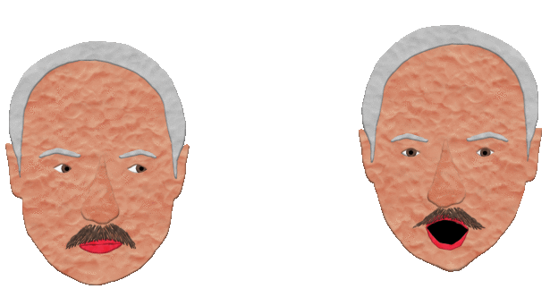

### 🥔💥🥔💥🥔💥🥔💥🥔💥🥔💥🥔💥🥔💥🥔💥🥔💥🥔💥🥔💥🥔💥🥔

&nbsp

### Potato Destroyer

Prototype of plasticine PWA game. **Offline ready** & **installable**

&nbsp

  
  &nbsp&nbsp&nbsp&nbsp&nbsp&nbsp&nbsp&nbsp&nbsp
  

&nbsp

&nbsp

---

&nbsp

### Repo contains all graphic sources and animations

#### Skeletal & runtime animation with DragoneBones:

  
  &nbsp&nbsp&nbsp&nbsp&nbsp&nbsp&nbsp
  
  &nbsp&nbsp&nbsp&nbsp&nbsp&nbsp&nbsp
  
  

&nbsp

#### Bitmap pseudo-plasticine fonts:

&nbsp

  

&nbsp

###### And more than 25 psd and dragonbones source files.

&nbsp

---

&nbsp

### ⛏ How to build project:

1. Install Node.js
2. Run `npm i` at root directory
3. Run `gulp` or `gulp prod` (for production build)

&nbsp

---

&nbsp

### Created by [Sergey Pimenov](https://github.com/sergey-pimenov) with ❤️ and:
* 🕹 [Phaser 3](https://phaser.io/)
* 🐉 [DragonBones](http://dragonbones.com/en/)
* 🎨 Plasticine & Photoshop
* 🌐 Deployed with [Netlify](https://www.netlify.com)

&nbsp

This is my first attempt at making games so sorry for the quality 💩 of the code and everything else.

&nbsp

  

    
  

  
 Destroy potatoes! 

